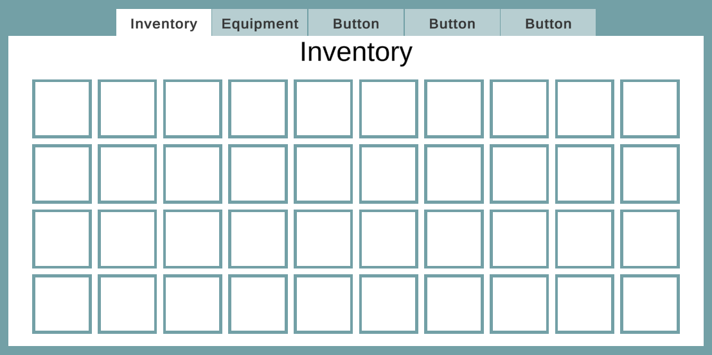
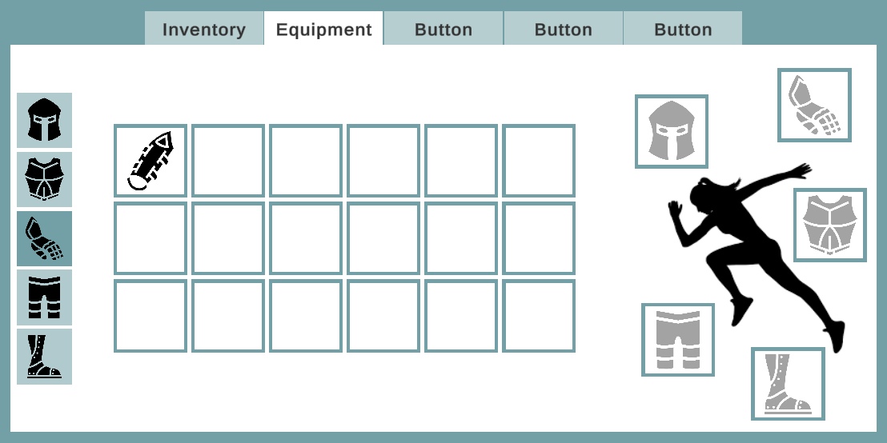

# Panel Tabber

Quick and easy tabbing panels in Unity





## Installation
This project uses [Odin Inspector](https://assetstore.unity.com/packages/tools/utilities/odin-inspector-and-serializer-89041), which I cannot redistribute. If you don't own Odin Inspector, I would highly recommend purchasing it otherwise you won't be able to serialize interface instances as members which completely breaks this solution.

#### Package Manager
##### Git Extension
First, do yourself a favor and add the [UPM Git Extension](https://github.com/mob-sakai/UpmGitExtension) package to your project. This package makes git packages many times easier to use in your project. simply add `https://github.com/mob-sakai/UpmGitExtension.git` as a new package via the git option in the package manager. Afterwords, reopen the Package Manager.

Next, add this repo. In the top left, you will find a git logo. This button will show a small menu for adding git packages to your project. add `https://github.com/FedoraDevStudios/Panel-Tabber.git` in the `Repository URL` box and hit `Find Versions`. Select the latest version and then `Install Package`.

#### UPM Upgrade
If you added the Git Extension package, then you can change the installed version just like any other package.

#### Manual Installation
This can be added as a dependency to your Unity project manually. You just need to add a reference to this repo to your project's `Packages/manifest.json` file. Be sure to switch `[version]` with whichever release you would prefer, e.g. `.git#1.0.0`.

```js
{
	"dependencies": {
		...,
		"com.fedoradev.paneltabber": "https://github.com/FedoraDevStudios/Panel-Tabber.git#[version]"
	}
}
```

#### Manual Upgrade
After installing manually, you have to change both `Packages/manifest.json` and `Packages/packages-lock.json`. In the former, simply update the dependency with the version you wish to pull. In the lock file, you need to remove the entry for the package. This entry is a few lines long and everything needs to be deleted, including the curly braces. After this is successfully completed, moving back to Unity will force the application to download the desired version.

## Usage
The easiest way to use this package is with the built-in behaviour component. Create a structure with a similar structure to below. Note you do not have to nest additional Tab Panels, this is only to illustrate that it is possible. Also note, technically you do not need to follow this structure to a T. You can assign any arbitrary button with any arbitrary element.

```
Canvas
└── Tab Panel
|	└── Tabs
|	|	└── Btn Tab 1
|	|	└── Btn Tab 2
|	|	└── Btn Tab 3
|	|	└── Btn Tab 4
|	└── Panels
|	|	└── Panel 1
|	|	└── Panel 2
|	|	└── Panel 3
|	|	└── Tab Panel
|	|	|	└── Tabs
|	|	|	|	└── Btn Tab 1
|	|	|	|	└── Btn Tab 2
|	|	|	|	└── Btn Tab 3
|	|	|	└── Panels
|	|	|	|	└── Panel 1
|	|	|	|	└── Panel 2
|	|	|	|	└── Panel 3
```

Once this structure is in place, add the `TabPanelBehaviour` component to the `Tab Panel` and choose the implementation you would prefer in the drop down. If you use `CategoryTabber`, then simply add `Tabs` as the Tab Parent and `Panels` as the Panel Parent. If you choose `TabToPanelTabber`, then you will have to assign the individual tab buttons and panel objects instead. The index of the tab aligns with the index of the panel.

Now that you have the references assigned, you can use the `Next Tab` and `Previous Tab` to cycle through. Note that the buttons will likely need to have their transitions for `Normal Color` and `Disabled Color` swapped so the active tab looks more prominent. This does come down to the style of your game, though. The functionality of this system is completely agnostic to the style of your game.

## Implementation
As with all of our systems, you can implement your own Tab Panel implementations. The only interface in the system is `ITabPanel` and there are only 4 items to implement. This package includes a few examples out of the box to get you up and running, the simplest of which is `TabToPanelTabber`. This sample uses Buttons as tabs and automatically adds `GoToTab` to the click events on each button.

The 4 items you need to implement are as follows:
```c#
int ActiveTab { get; }
int TabQuantity { get; }
void Initialize();
void GoToTab();
```

### ActiveTab
This simply returns the currently active tab. In the example, I'm running a quick calculation to find the first non-interactable button and returning that index.

### TabQuantity
This just returns the amount of tabs that are present.

### Initialize
This is where any first-time setup is run. With the `TabPanelBehaviour`, this is called during `OnEnable`.

### GoToTab
This is where the magic happens. Given an index, this function disables any visible panels and enables the desired one. It also changes the buttons to their required interactable state.